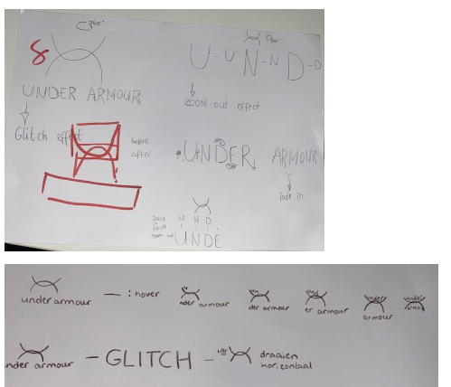
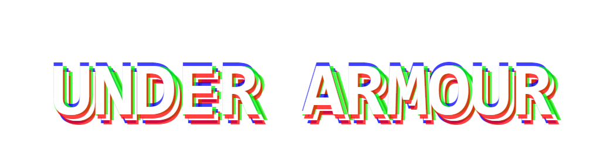
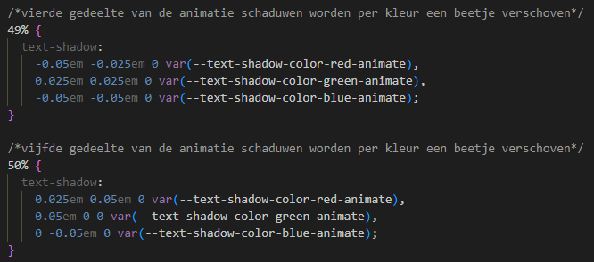
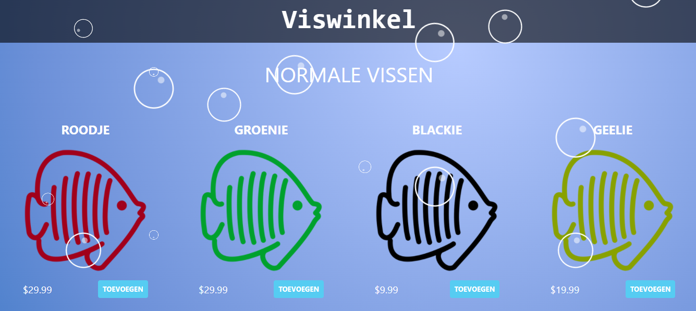
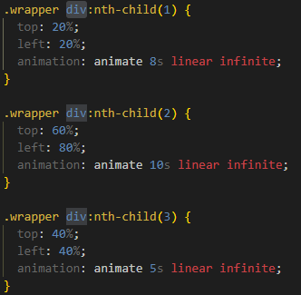
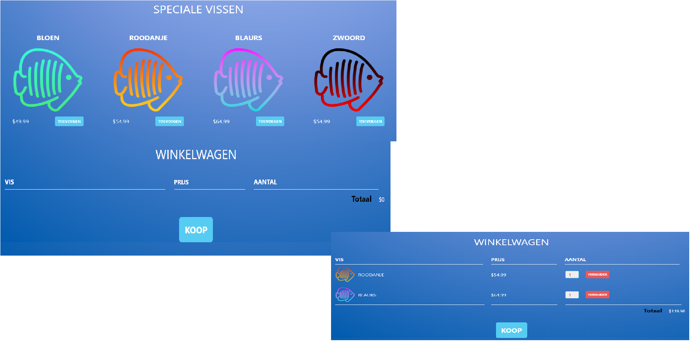

# Procesverslag
**Auteur:** -Adil el Bardai-

**De opdrachten:** [opdracht 1](opdracht1/index.html) en [opdracht 2](opdracht2/index.html)

Markdown is een simpele manier om HTML te schrijven.  
Markdown cheat cheet: [Hulp bij het schrijven van Markdown](https://github.com/adam-p/markdown-here/wiki/Markdown-Cheatsheet).

Nb. De standaardstructuur en de spartaanse opmaak van de README.md zijn helemaal prima. Het gaat om de inhoud van je procesverslag. Besteedt de tijd voor pracht en praal aan je website.

Nb. Door *open* toe te voegen aan een *details* element kun je deze standaard open zetten. Fijn om dat steeds voor de relevante stuk(ken) te doen.

## Bronnenlijst
  1. Mixkit: voor de sound effect - https://mixkit.co/free-sound-effects/bubbles/
  2. YouTube: voor de shopping cart - https://www.youtube.com/watch?v=YeFzkC2awTM&t=983s
  3. Thenounproject: voor de visjes in png - https://thenounproject.com/search/icons/?iconspage=1&q=fish

## Opdracht 1 plan

  
uitwerken na schetsen idee (voor week 2)

  ### Je storyboard:
  

  ### Je ambitie: 
  Aan deze technieken/punten wil ik werken:
  - Glitch effect
  - Before en after
  - Animatie
  - CSS custom proterties
 

## Opdracht 1 reflectie

  
uitwerken bij afronden opdracht (voor week 4)

  ### Je uitkomst - karakteristiek screenshot(s):
  

  ### Dit ging goed/Heb ik geleerd: 
  De kleuren van de letters achter elkaar positioneren. Dit is mij gelukt, doordat
  ik in de eerste instantie 3 verschillende text tags had gebruikt.

  

  ### Dit was lastig/Is niet gelukt:
  De glitch effect werkend krijgen, met de kleuren die heen en weer bewegen. 
  Per animatie scene lukte het me niet om het bewegend te krijgen.

  

## Opdracht 2 plan

  
uitwerken na schetsen idee (voor week 5)

  ### Je ontwerp:
  

  ### Je ambitie: 
  Aan deze technieken/punten wil ik werken:
  - Volledig responsive
  - Geavanceerde Javascript code
  - Animatie

## Opdracht 2 test

  
uitwerken na testen (week 7)

  Neem minimaal 5 bevindingen op:

  ### Bevinding 1:
  Bellen animatie op de achtergrond had geen beweging en stond niet goed gepositioneerd

  #### oplossing:
  Ik had het opgelost door voor elke bel een span/div te gebruiken en deze op steeds een andere
  seconde animeren zodat er verschil in zit.
  

  ### Bevinding 2:
  Vis toevoegen aan winkelwagen

  #### oplossing:
  Heb ik in javascript een functie geschreven die de afbeelding van de vis, prijs en aantal toevoegd
  aan je winkelwagen.
  

## Opdracht 2 reflectie

  
uitwerken bij afronden opdracht (voor week 8)

  ### Je uitkomst - karakteristiek screenshot(s):
  

  ### Dit ging goed/Heb ik geleerd: 
  Het plaatsen van alle elementen op de pagina ging best goed. Ik wist alles wel op de juiste plek
  te krijgen met flexbox dus dat ging top.

  ### Dit was lastig/Is niet gelukt:
  Wat niet was gelukt is een zoekbalk die ervoor zorgt dat je specifiek op een visnaam kunt zoeken.
  Na een paar keer proberen gaf ik de hoop op

